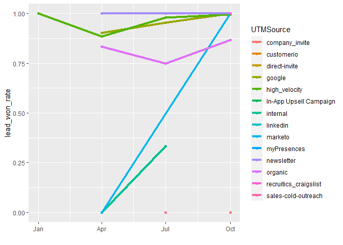

## Introduction

The goal of this project is to identify attributes of contact data that correlate with over performance and under-performance in terms of funnel conversion

Funnel Stages: Inquiry → MQL → SAL → SQL → SQO → Won

Notes on nuance in the data

For all Campaigns except "US_FY17_HDC_SignUp", here are the definitions:

-   Inquiry - Exclude these as these contacts will not be worked by sellers\^1

-   MQL - Marketing qualified leads that are routed to sellers to be worked

-   SAL - Meeting is booked with the contact and an opportunity is created

-   SQL - Opportunity moved to at least stage 2 "Qualified"\^2

-   SQO - Opportunity moved beyond stage 2

-   Won - Either opportunity was closed won with Opportunity Amount \> \$0 OR opportunity was closed lost but closed lost reason = Signed Up for Access\^3

"US_FY17_HDC_SignUp" Campaign needs to be analyzed by itself as there is an automation in Salesforce that automatically moves contacts who confirm their emails in the customer's product from the MQL to SQL stage.

For these contacts, we need to look at SQO and Win conversion which have the same definitions as the other campaigns listed above.

Some Contacts are marked as disqualified. These contacts where Person or Contact Status = Disqualified should be removed from the analysis.


Average win percentage is 45%.

## Filtering Data


In order to optimize time working on columns that have relevant information filtering columns that have a threshold of fill rate higher than an arbitrary percentage. The amounts were for 50%, 70% and 90%, respectively, 185, 72 and 60 attributes. The selected threshold is 90%.


|                                        |col                                     | uniques|
|:---------------------------------------|:---------------------------------------|-------:|
|Acquisition Date                        |Acquisition Date                        |    2851|
|Acquisition Program                     |Acquisition Program                     |      55|
|Add to Marketo Campaign                 |Add to Marketo Campaign                 |    2842|
|Admin Update Counter                    |Admin Update Counter                    |      23|
|Behavior Score                          |Behavior Score                          |       7|
|Campaign Type                           |Campaign Type                           |      15|
|City                                    |City                                    |     631|
|Company Name                            |Company Name                            |    2798|
|Country                                 |Country                                 |     108|
|Created At                              |Created At                              |    2842|
|DF Account Score (Stamped)              |DF Account Score (Stamped)              |     255|
|DeletedFromDiscoverOrg                  |DeletedFromDiscoverOrg                  |       2|
|Email Address                           |Email Address                           |    2852|
|Entered Raw                             |Entered Raw                             |    2798|
|First Name                              |First Name                              |    1880|
|Full Name                               |Full Name                               |    2805|
|IT Org Chart                            |IT Org Chart                            |      90|
|Job Function Score                      |Job Function Score                      |       3|
|Job Level Score                         |Job Level Score                         |       5|
|Last Name                               |Last Name                               |    2340|
|Last Response Date                      |Last Response Date                      |     387|
|Lead Currency                           |Lead Currency                           |       2|
|Sales Owner Email Address               |Sales Owner Email Address               |      54|
|Sales Owner First Name                  |Sales Owner First Name                  |      53|
|Sales Owner Last Name                   |Sales Owner Last Name                   |      55|
|Person Score                            |Person Score                            |      14|
|Person Source                           |Person Source                           |       6|
|Lead Source Description                 |Lead Source Description                 |      10|
|MQL Day of Week                         |MQL Day of Week                         |       8|
|Marketo SFDC ID                         |Marketo SFDC ID                         |    2842|
|Marketo Unique Code                     |Marketo Unique Code                     |    2856|
|Marketo Unique Name                     |Marketo Unique Name                     |    2856|
|Most Recent Campaign                    |Most Recent Campaign                    |      79|
|Most Recent Campaign Member Status      |Most Recent Campaign Member Status      |      21|
|Name Created Date                       |Name Created Date                       |     453|
|Number of Opportunities                 |Number of Opportunities                 |      11|
|Original Source Info                    |Original Source Info                    |      81|
|Original Source Type                    |Original Source Type                    |       6|
|Person Time Zone                        |Person Time Zone                        |     111|
|Registration Source Info                |Registration Source Info                |      56|
|Registration Source Type                |Registration Source Type                |       4|
|Response Score                          |Response Score                          |       4|
|Response count                          |Response count                          |      24|
|SFDC Campaigns                          |SFDC Campaigns                          |     324|
|SFDC Type                               |SFDC Type                               |       3|
|Sales Created Date                      |Sales Created Date                      |    2837|
|Segmentation_ActiveMetropolis_1005      |Segmentation_ActiveMetropolis_1005      |      18|
|Segmentation_Approved_1001              |Segmentation_Approved_1001              |       2|
|Segmentation_ClientsVsCandidates_1008   |Segmentation_ClientsVsCandidates_1008   |       1|
|Segmentation_CommonEmailExclusions_1004 |Segmentation_CommonEmailExclusions_1004 |       7|
|Segmentation_DFAccountTier_1012         |Segmentation_DFAccountTier_1012         |       4|
|Segmentation_GDPROptin_1006             |Segmentation_GDPROptin_1006             |       2|
|Segmentation_NurturePersona2023_1014    |Segmentation_NurturePersona2023_1014    |       6|
|Segmentation_Personas_1007              |Segmentation_Personas_1007              |       5|
|Sourced from Data.com                   |Sourced from Data.com                   |       2|
|State                                   |State                                   |     223|
|Status Age                              |Status Age                              |     325|
|Status Last Set                         |Status Last Set                         |    2445|
|Updated At                              |Updated At                              |     927|
|Usertype                                |Usertype                                |       3|
|lead_won                                |lead_won                                |       2|

With this in mind a few columns have been selected for a correlation analysis in the next section.

## Correlation Analysis

The analysis in this section will be split for each stage of the opportunity pipeline, aiming to find which attribute has highest correlation winning the lead. For numerical attributes the method selected to draw a comparison between itself and the success metric is ANOVA, as for categorical attributes, chi-squared test.

### MQL Stage


```r
mql_contact_data <- subset(contact_data,`Marketing Funnel State`=='MQL')
```


```r
mql_numeric <- sapply(numeric_cols, function(x,cdata=mql_contact_data){
        t_test <- t.test(formula = get(x) ~ factor(lead_won),data = cdata, paired=FALSE)
        x.aov <- aov(formula = get(x) ~ factor(lead_won), data = cdata)
        x.anova <- anova(x.aov)
        list(t_test$p.value, x.anova[1,5])
})
df_num <- as.data.frame(t(data.frame(mql_numeric))) %>% arrange(V1) %>% filter(V1<0.05)
colnames(df_num) <- c('t.test_pvalue','anova_p_value')
knitr::kable(df_num)
```


|                        |t.test_pvalue |anova_p_value |
|:-----------------------|:-------------|:-------------|
|Admin.Update.Counter    |0.001229178   |0.0002423441  |
|Behavior.Score          |1.450705e-20  |2.102016e-09  |
|Job.Function.Score      |9.029178e-08  |1.459987e-18  |
|Person.Score            |1.606398e-11  |2.415799e-12  |
|Number.of.Opportunities |1.358728e-30  |5.880638e-192 |


```r
mql_categorical <- sapply(cat_cols, function(x,cdata=mql_contact_data){
        cdata <- na.omit(cdata[,c(x,'lead_won')])
        if(nrow(unique(cdata[x]))>1 & length(unique(cdata$lead_won))>1){
                chisq_test <- chisq.test(cdata[x],cdata$lead_won, simulate.p.value = TRUE)
                list(chisq_test[3]$p.value)
        } else 1
})
df_cat <- as.data.frame(t(data.frame(mql_categorical))) %>% arrange(V1) %>% filter(V1<0.05)
colnames(df_cat) <- c('chisq.test_pvalue')
knitr::kable(df_cat)
```


|                                   | chisq.test_pvalue|
|:----------------------------------|-----------------:|
|Acquisition.Program                |         0.0004998|
|Campaign.Type                      |         0.0004998|
|Person.Source                      |         0.0004998|
|Most.Recent.Campaign.Member.Status |         0.0004998|
|Original.Source.Type               |         0.0004998|
|Registration.Source.Info           |         0.0004998|
|Registration.Source.Type           |         0.0004998|
|SFDC.Campaigns                     |         0.0004998|
|SFDC.Type                          |         0.0004998|
|Usertype                           |         0.0004998|
|IT.Org.Chart                       |         0.0064968|
|Region                             |         0.0094953|
|Sales.Owner.Email.Address          |         0.0134933|
|Lead.Source.Description            |         0.0344828|
|Job.Level                          |         0.0479760|

### SQO Stage


```r
sqo_contact_data <- subset(contact_data,`Marketing Funnel State`=='SQO')
```


```r
sqo_numeric <- sapply(numeric_cols, function(x,cdata=mql_contact_data){
        t_test <- t.test(formula = get(x) ~ factor(lead_won),data = cdata, paired=FALSE)
        x.aov <- aov(formula = get(x) ~ factor(lead_won), data = cdata)
        x.anova <- anova(x.aov)
        list(t_test$p.value, x.anova[1,5])
})
df_num <- as.data.frame(t(data.frame(sqo_numeric))) %>% arrange(V1) %>% filter(V1<0.05)
colnames(df_num) <- c('t.test_pvalue','anova_p_value')
knitr::kable(df_num)
```


|                        |t.test_pvalue |anova_p_value |
|:-----------------------|:-------------|:-------------|
|Admin.Update.Counter    |0.001229178   |0.0002423441  |
|Behavior.Score          |1.450705e-20  |2.102016e-09  |
|Job.Function.Score      |9.029178e-08  |1.459987e-18  |
|Person.Score            |1.606398e-11  |2.415799e-12  |
|Number.of.Opportunities |1.358728e-30  |5.880638e-192 |


```r
sqo_categorical <- sapply(cat_cols, function(x,cdata=sqo_contact_data){
        cdata <- na.omit(cdata[,c(x,'lead_won')])
        if(nrow(unique(cdata[x]))>1 & length(unique(cdata$lead_won))){
                chisq_test <- chisq.test(cdata[,x],cdata$lead_won, simulate.p.value = TRUE)
                list(chisq_test[3]$p.value)
        } else 1
})
df_cat <- as.data.frame(t(data.frame(sqo_categorical))) %>% arrange(V1) %>% filter(V1<0.05)
colnames(df_cat) <- c('chisq.test_pvalue')
knitr::kable(df_cat)
```


|                                   | chisq.test_pvalue|
|:----------------------------------|-----------------:|
|Acquisition.Program                |         0.0004998|
|Campaign.Type                      |         0.0004998|
|Sales.Owner.Email.Address          |         0.0004998|
|Most.Recent.Campaign.Member.Status |         0.0004998|
|Registration.Source.Type           |         0.0004998|
|SFDC.Campaigns                     |         0.0004998|
|Region                             |         0.0004998|
|UTMSource                          |         0.0004998|
|Person.Time.Zone                   |         0.0009995|
|State                              |         0.0009995|
|Original.Source.Type               |         0.0019990|
|Registration.Source.Info           |         0.0034983|
|IT.Org.Chart                       |         0.0059970|

In this step we noticed that in the MQL stage all numeric variables have a general correlation to the result (5%), but as for categorical, none of the UTM, Job, City and State parameters are statistically relevant. 

In the SQO step there is a notable appearence of the UTMSource variable as relevant.

As for specific analysis for each campaign, its possible to filter data and redo the analysis to see changes in the correlated variables.

## UTMSource conversion changes


```r
df <- contact_data %>% filter(!is.na(UTMSource)) %>%
        mutate(quarter=floor_date(ymd(`MQL Date`),'quarter')) %>% 
        filter(year(quarter)==2022) %>%
        group_by(UTMSource,quarter) %>% 
        summarise(.by = ,lead_won_rate=mean(lead_won))
p <- ggplot(df, aes(x=quarter, y=lead_won_rate, group=UTMSource, color=UTMSource)) +
  geom_line(linewidth=1.5) + geom_point() +
  xlab("")
p
```

<!-- -->

Looking at the trends it seems that `myPresences` has a notable increase in conversion rate


